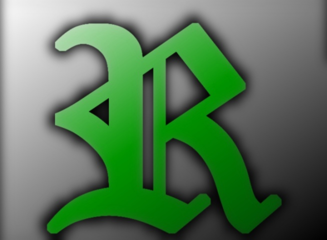
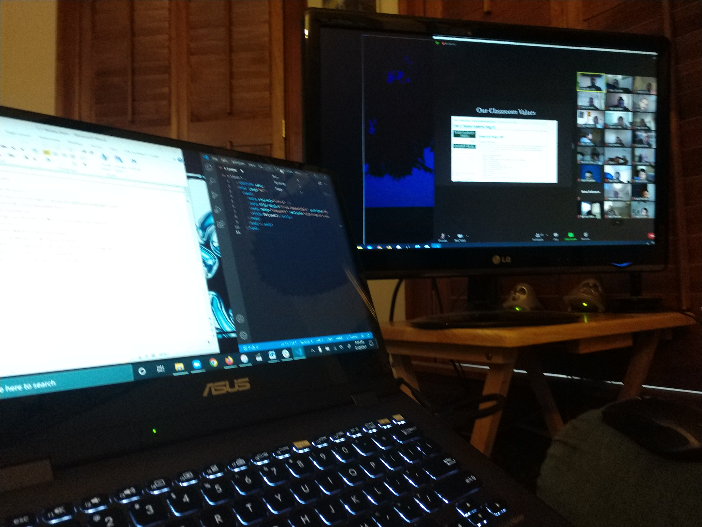

 
 
 
 
 
 

<table>
  <tr><td></td>
  <td> My name is Ryan Crowder, and I am presenting to you my skills, my experience, and my character for your consideration. But, what you really want to know is how any of this benefits you and your organization; and that all comes down to getting a job done, or in other words, project management.</td>
  </tr>
 </table>

<table>
  <tr><td></td>
  <td> At Furman University, I studied mass communications, but my passion was the campus, closed-circuit TV station, of which I served as Executive director for two years. I learned many lessons about leadership and utilizing a team’s strengths and weaknesses by try to organize a group of college who all would rather be sleeping off last night’s festivities than finishing an assignment or sitting in front of a computer.</td>
  </tr>
  </table>

<table>
  <tr><td></td>
  <td>In my current course of Boot-camp training, I find a new challenge in learn to code that drives me forward, but the people and interactions are steadying familiarity that serve as my foundation. Group projects, mini-projects, homework assignments — some are solitary works, some are collaborative. </td>
  </tr>
  </table>

<table>
  <tr><td></td>
  <td>So far my path has taught me CSS-JavaScript-NodeJS-GitHub, but the future is full of unexpected and diverse new challenges. However, there are some things that will always be needed, always be necessary: Fulfilling the roles of the individual in order for the whole group to succeed: I have been the lead: making the calls and directing the action – I have been the troubleshooter: doing the groundwork and preparing the contingences – I have been the planner: conceptualizing, adapting, and realizing – I have been the backstop: filling-in, putting in the hours, and making sure completion is a functional reality. All require an adaptable, creative mind with strong communication skills and a solid work ethic. </td>
  </tr>
  </table>

<a href="mailto:rebuiltrival@gmail.com">Email Me</a>

<a href="https://crowderyan.github.io/React-Portfolio/">Check Out My Portfolio</a>

<a href="https://www.linkedin.com/in/ryan-crowder-487348209/">View My LinkedIn</a>

<!--
**CrowdeRyan/CrowdeRyan** is a ✨ _special_ ✨ repository because its `README.md` (this file) appears on your GitHub profile.

Here are some ideas to get you started:

- 🔭 I’m currently working on ...
- 🌱 I’m currently learning ...
- 👯 I’m looking to collaborate on ...
- 🤔 I’m looking for help with ...
- 💬 Ask me about ...
- 📫 How to reach me: ...
- 😄 Pronouns: ...
- 🔭 I’m currently working on ...
- 🌱 I’m currently learning ...
- 🤔 I’m looking for help with ...
- ⚡ Fun fact: ...
- 👯 I’m looking to collaborate on ...
-->
